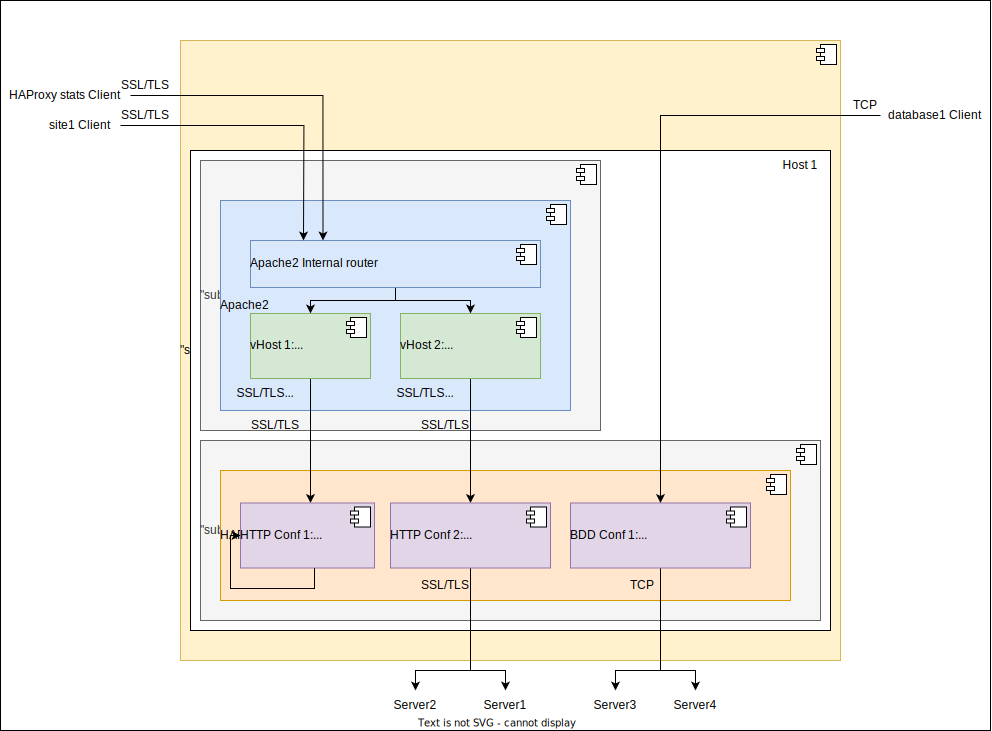

# Ansible playbook: labocbz.deploy_haproxy


## Description


An Ansible playbook to deploy and configure HAProxy on your host.

This playbook is designed to streamline the deployment of HAProxy, a highly versatile load balancer and proxy server. The deployment process begins by installing HAProxy and setting up a foundational configuration that allows for the addition of new configurations in the future.

The playbook offers two types of configurations: HTTP and Database (BDD). The HTTP configuration is ideal for defining components like HTTP/HTTPS load balancers, which act as service abstraction configurations. For example, when you need to distribute client traffic among members of an Apache2 cluster, HAProxy can enhance these configurations, making it a more suitable solution compared to Apache2's internal load balancer.

The BDD configurations, on the other hand, are used to define load balancer components for database systems such as MariaDB or Redis. Additionally, HAProxy provides a stats page for load balancer statistics visualization. You can easily add an Apache2 server to provide an additional layer of protection for this service, granting secure access to the stats page.

Furthermore, the playbook allows for the deployment of various Apache2 configurations. This means you can set up Apache2 as a reverse proxy with SSL, Web Application Firewall (WAF), Quality of Service (QOS), and strengthen security by integrating LDAP. A basic installation includes HAProxy with diverse load balancing components, stats access, and an Apache2 web frontend configured as a secure SSL-protected LDAP-authenticated reverse proxy.

To facilitate customization and adaptation to your specific requirements, the playbook uses boolean variables. You can set these variables in configuration files or directly in host and playbook variables. For example, you can set `inv_install_apache: true` to indicate your desire to install Apache2 or not.

This playbook simplifies the deployment process, making HAProxy and Apache2 configurations easily manageable and adaptable to your specific needs, enhancing the scalability, security, and performance of your services.

## Deployment diagramm



Here, we can observe a typical deployment of an SSL reverse proxy load balancer with enhanced security layers. The playbook can be utilized as follows: Deploying HAProxy as a load balancer for HTTP or database (BDD) / TCP services and deploying Apache2 as an SSL reverse proxy with additional security features like a Web Application Firewall (WAF), Quality of Service (QOS), LDAP integration, and more.

We can see that a client looking to access Site 1 will follow the same route to Apache2. As Apache2 serves as our reverse proxy, we can envision multiple virtual host (vhost) configurations, each associated with different domains, providing various routing possibilities to HAProxy load balancer components.

## Tests and simulations

### Basics

You have to run multiples tests. *tests with an # are mandatory*

```MARKDOWN
# lint
# syntax
# converge
# idempotence
# verify
side_effect
```

Executing theses test in this order is called a "scenario" and Molecule can handle them.

Molecule use Ansible and pre configured playbook to create containers, prepare them, converge (run the playbook) and verify its execution.
You can manage multiples scenario with multiples tests in order to get a 100% code coverage.

This playbook contains a ./tests folder. In this folder you can use the inventory or the tower folder to create a simualtion of a real inventory and a real AWX / Tower job execution.

### Command reminder

```SHELL
# Check your YAML syntax
yamllint -c ./.yamllint .

# Check your Ansible syntax and code security
ansible-lint --config=./.ansible-lint .

# Execute and test your playbook
molecule lint
molecule create
molecule list
molecule converge
molecule verify
molecule destroy

# Execute all previous task in one single command
molecule test
```

## Installation

To install this playbook, just copy/import this playbook or raw file into your fresh playbook repository or call it with the "include_playbook/import_playbook" module.

## Usage

### Vars

```YAML
# From inventory
---
# all vars from to put/from your inventory
# see tests/inventory/group_var for all groups and vars.
```

```YAML
# From AWX / Tower
---
all vars from to put/from AWX / Tower
```

## Architectural Decisions Records

Here you can put your change to keep a trace of your work and decisions.

### 2023-10-15: First Init

* First init of this playbook with the bootstrap_playbook playbook by Lord Robin Crombez

### 2023-10-15-b first deployment

* Playbook hanlde install of HAProxy
* Playbook handle install of Apache2 as frontal reverse proxy
* Playbook deploy HAProxy HTTP confs
* Playbook deploy HAProxy BDD confs
* Playbook can remove all old confs before deploy another one
* Playbook basically install a Reverse Proxy SSL SecOptions Load Balancer

### 2023-12-16: System users

* Role can now use system users and address groups
* Updated with 10 years cert

### 2023-12-18: Logs, reorganize

* Now you can deploy HTTP and BDD conf with the same run
* You have to pass with Apache2 if enabled
* Iptables rule for block external access to HAProxy if Apache2 enabled

### 2024-03-02: Remastered

* Imported new CICD
* Rework global on readme
* Rename of vars __ and refacto

## Authors

* Lord Robin Crombez

## Sources

* [Ansible playbook documentation](https://docs.ansible.com/ansible/latest/playbook_guide/playbooks_reuse_playbooks.html)
* [Ansible Molecule documentation](https://molecule.readthedocs.io/)
* [labocbz.prepare_host](https://github.com/CBZ-D-velop/Ansible-Role-Labocbz-Prepare-Host.git)
* [labocbz.add_certificates](https://github.com/CBZ-D-velop/Ansible-Role-Labocbz-Add-Certificates.git)
* [labocbz.install_haproxy](https://github.com/CBZ-D-velop/Ansible-Role-Labocbz-Install-Haproxy.git)
* [labocbz.add_haproxy_http_confs](https://github.com/CBZ-D-velop/Ansible-Role-Labocbz-Add-Haproxy-HTTP-Confs.git)
* [labocbz.add_haproxy_bdd_confs](https://github.com/CBZ-D-velop/Ansible-Role-Labocbz-Add-Haproxy-BDD-Confs.git)
* [labocbz.install_apache](https://github.com/CBZ-D-velop/Ansible-Role-Labocbz-Install-Apache.git)
* [labocbz.add_apache_confs](https://github.com/CBZ-D-velop/Ansible-Role-Labocbz-Add-Apache-Confs.git)